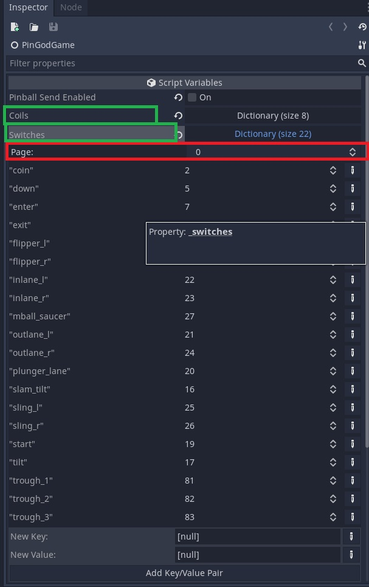

# 2. Adding machine items
---

## Adding GameItems to Machine Class
---

In the `PinGodGame.tscn` scenes inspector in Godot you can edit the machines `Coils, Switches, Lamps, Leds`.

When the game is loaded these will be added to the machine. They can be accessed inside the `Machine.cs` or use the Games helper methods with the item name.

When adding from the UI select `String` and `Int` for the value.

