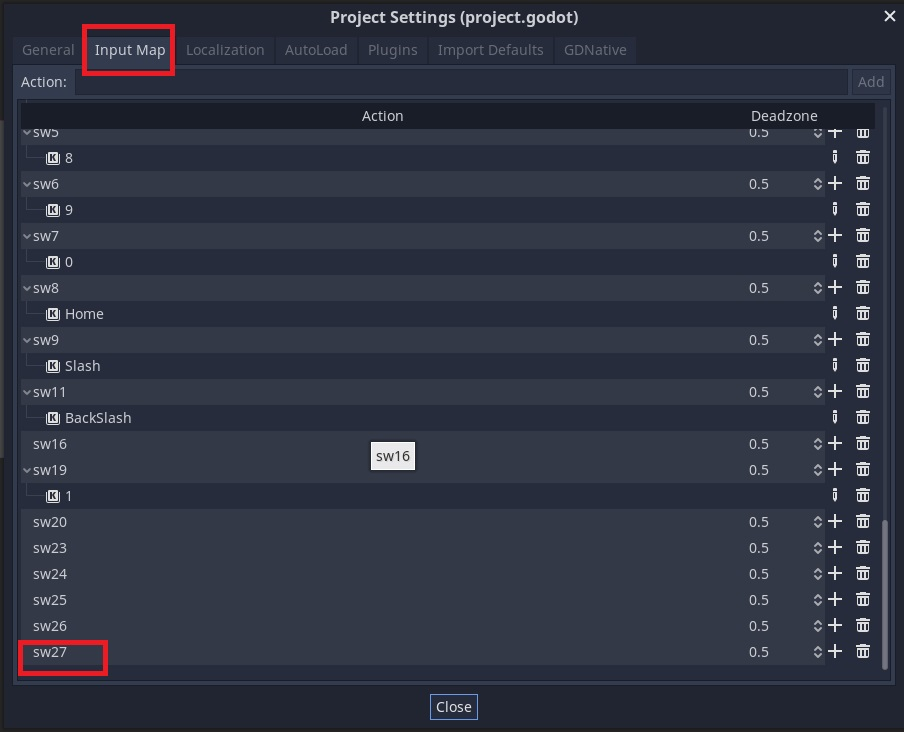

# 3. Inputs - Actions - Switches
---

## Switches

In the projects `Input Map` add switches like the example below.

Switches convert to these actions and you can assign keys to test game switches direct in window.

An action comes into Godot like this so we know it's a switch. You can create any action here and trigger it from Visual Pinball, see pause and quit which is assigned to ESC but also used externally.



The following are the default switches. These were copied by opening the `PinGodGame.tscn` in a text editor, you can add them here if you find it faster than godot inspector.

```
_switches = {
"coin": 2,
"down": 5,
"enter": 7,
"exit": 4,
"flipper_l": 11,
"flipper_r": 9,
"inlane_l": 22,
"inlane_r": 23,
"mball_saucer": 27,
"outlane_l": 21,
"outlane_r": 24,
"plunger_lane": 20,
"slam_tilt": 16,
"sling_l": 25,
"sling_r": 26,
"start": 19,
"tilt": 17,
"trough_1": 81,
"trough_2": 82,
"trough_3": 83,
"trough_4": 84,
"up": 6
}
```

## Using in game

### Inside _Input(InputEvent @event)

Check if a switch has just been triggered on / off.

```
//pinGod is a reference to the PinGodGame
if (pinGod.SwitchOn("inlane_l", @event))
{
    AddPoints(100);
}
```

### Check a switch state anywhere

```
bool isInlaneOn = pinGod.SwitchOn("inlane_l");

```