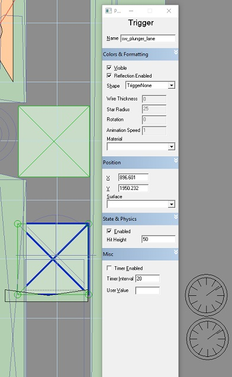

# 4. Visual Pinball Switches / Actions
---

## Visual Pinball - Scripting Switches

### Standard
---

```
Sub sw_plunger_lane_hit() : Controller.Switch 20, 1 :  End Sub   
Sub sw_plunger_lane_unhit() : Controller.Switch 20, 0 :  End Sub
Sub sw_spinner_spin() : Controller.Switch 21, 0 :  End Sub
```

### VPM Pulse Switch

`vpmTimer.PulseSw 26`


### Auto Switch handlers
---

In the BasicGame Visual Pinball table switches are added to a collection named `AllSwitches`.

Add the switch number to the `TimerInterval` and add the switch to the `AllSwitches` collection.

This would allow us to remove the switch handlers like this `sw_plunger_lane_hit` if we don't need to do anything else when the switch is triggered.

All objects should be covered so you wouldn't have to remember to use `Spin` instead of `Hit` for a spinner.





