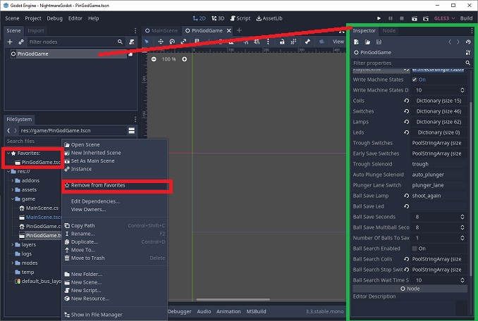

# 7. PinGodGame.tscn - Scene

This scene is autoloaded with a game and you should add this scene as a favorite in Godots favorites scene tree for quicker access.

Most modes rely on this being loaded by using `GetNode("/root/PinGodGame")`

## Scene Inspector (Game / Machine Options)

Scene inspector uses `[export]`s that are defined in `game\PinGodGame.cs`

### Logging Level

Sets the logging level.

### Machine states

Writes machine states to memory. Used for Visual pinball, can be switched off while developing.

### Machine Items

These Dictionaries populate the `Machine` items. 

Add Key/Value Pairs string / int : `"auto_plunger" - 3`

- Coils
- Switches
- Lamps
- Leds

*It is faster if you edit the scene file in a text editor and add your items there and reload scene if open in Godot*

Switches will need an action added in the projects `Input Map`. `sw34`, `sw55`

### Trough / Ball Save Options

- Ball save seconds
- Ball save lamp name
- Ball save multiball seconds
- Early Ball Save switches
- Number of Balls to Save
- Trough coil
- Trough switches

### Ball search options (TODO)

- Enabled
- Search coils to pulse
- Search stop switches
- Search wait time

### Recordings / Playback

#### Record Game  

Switch events are recording with time to recording file in the games user directory.

user://recordings/

#### Playback Game

Playback will override record game if enabled.

- Playbackfile = "user://recordings/132690368872978766.record"

This scene instantiates `AudioManager` and the `Trough`.