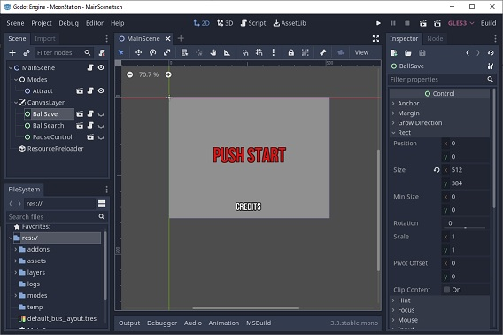
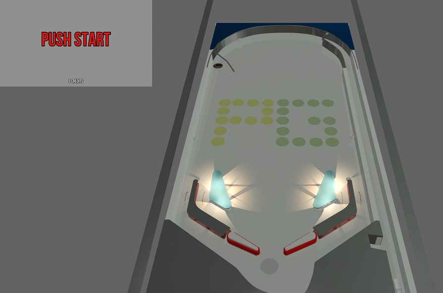

# PinGod.VP Examples
---

PinGod is a base framework (addons) and helpers for creating pinball games using the [Godot](https://godotengine.org/download) game engine. This was created for running alongside [Visual Pinball Simulation](https://github.com/vpinball/vpinball/releases) (The best, open source pinball simulation since 2000).

End users (Players) don't need `Godot` to play your game with `Visual Pinball` because you can export you game with the table. They would only need to setup the controller below.

### PinGod.VP Controller
---

[Controller Releases](https://github.com/horseyhorsey/PinGod.VP/releases)

#### Pinball machine game logic / display in Godot
---

Simulator - Visual Pinball

