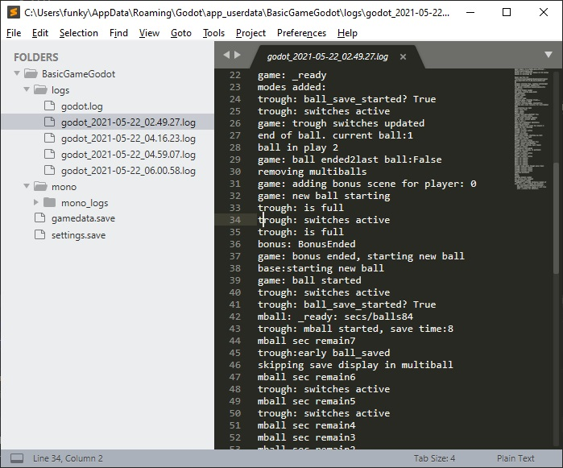

# PinGod - JawsGodot
---

Table authors use this as a base or example for building games in Godot for Visual Pinball.

See Godot documentation for general scene creating, project settings and everything else. https://docs.godotengine.org/en/stable/getting_started/step_by_step/scripting.html#introduction

## Setup before running

In this directory add a symbolic link to where the `addons` directory is. *Full path is necessary*

```
mklink /D addons "C:\Users\funky\source\repos\PinGod\PinGod.VP.Examples\addons\addons"
```

## Autoloaded Scenes / Scripts

You can find any of these in the project settings inside Godot. `Project Settings/Autoload`

### PinGodGame.cs
---

The base class `PinGodGameBase` this uses holds game specific variables. `BallsPerGame` `Players` and the like can be found for pinball.

This class you should add to for sharing properties and methods with other scenes. You can reference and use like so.

#### Adding Properties / Methods

Add a variable like `int SwitchesHit = 369` in `PinGodGame` and access from the node.

```
var pinGod = GetNode("/root/PinGodGame") as PinGodGame;
GD.Print("How many switches hit?", pinGod.SwitchesHit);
```

#### Audio Streams

See `AddAudioStreams` in `_EnterTree` to add more.

## Trough.cs

Basic handling of a trough in a pinball machine with added ball save. Ball saving requires a `plungerlane` switch number.

`res://addons/PinGodAddons/PinGodGame/Game/Trough`

## MainScene (res://game/MainScene)

This should be looked at as a master scene which controls the game and scene changes etc and never removed. Entirely up to you of course.

`StartGame` will remove the `attract mode scene` and load the Game scene into the Modes tree.

`EndGame` is invoked after trough checks in the actions where this will reload the entire `MainScene` scene removing the game and adding back in the attract.

Pause mode is inside this scene and listens for the `pause action`. `@event.IsActionReleased("pause")`

## Game (res://modes/Game)

After the player pushes start with a full trough and credits this scene is added to the tree.

In `_EnterTree` there are example `Signal` connections wired like the following.

```
pinGod.Connect("BallEnded", this, "OnBallEnded");
pinGod.Connect("BallStarted", this, "OnBallStarted");
```

See `Game.cs`

## Window keys

- Coin = 5
- Start = 1
- Trough Switch = Q, W, E, R
- Flippers = \, / - Can't use L-Shift and RShift
- Activator_0 = T
- Activator_1 = Y
- Activator_2 = U
- BruceVUK = I
- drop_0 = A
- drop_1 = S
- drop_2 = D
- drop_3 = F
- drop_4 = G
- drop_5 = H
- barrel_kicker = J
- Tilt = X
- Slam Tilt = END

See the `InputMap` tab in project settings

## Common Pinball - Basic Modes / Placeholders

- Attract
- Ball Saves
- Ball Search (Todo)
- Bonus (End of ball display)
- Multiball
- Pause
- Score Entry
- Score Mode
- Service Menu (TODO)
- Tilt
- Trough

# Logging / GameData / Settings
---

Can view most of it from the debug console window but if you miss something they can be found at `C:\Users\YOURNAME\AppData\Roaming\Godot\app_userdata\JawsGodot`.

Opening the folder in editors like `Sublime, VsCode` is a quick way to view your `SaveData`, `Settings` and `Logs`




ffmpeg -i "C:\P-ROC\Games\jaws\assets\dmd\Jaws_Jump.avi" -i "C:\P-ROC\Games\jaws\assets\sound\voice/Jaws_Jump.ogg" -map 0:v -map 1:a -c:v copy -codec:v libtheora -qscale:v 6 -codec:a libvorbis -qscale:a 6 jaws_jump.ogv
ffmpeg -i "C:\P-ROC\Games\jaws\assets\dmd\Chrissy_Death.avi" -i "C:\P-ROC\Games\jaws\assets\sound\voice/Chrissy_Death.ogg" -map 0:v -map 1:a -c:v copy -codec:v libtheora -qscale:v 6 -codec:a libvorbis -qscale:a 6 death_chrissy.ogv
ffmpeg -i "C:\P-ROC\Games\jaws\assets\dmd\Boy_Death.avi" -i "C:\P-ROC\Games\jaws\assets\sound\voice/Boy_Death.ogg" -map 0:v -map 1:a -c:v copy -codec:v libtheora -qscale:v 6 -codec:a libvorbis -qscale:a 6 death_boy.ogv

ffmpeg -i "C:\P-ROC\Games\jaws\assets\dmd\Brody_ShotMiss01.avi" -i "C:\P-ROC\Games\jaws\assets\sound\voice/Brody_ShotMiss01.ogg" -map 0:v -map 1:a -c:v copy -codec:v libtheora -qscale:v 6 -codec:a libvorbis -qscale:a 6 brody_miss_01.ogv
