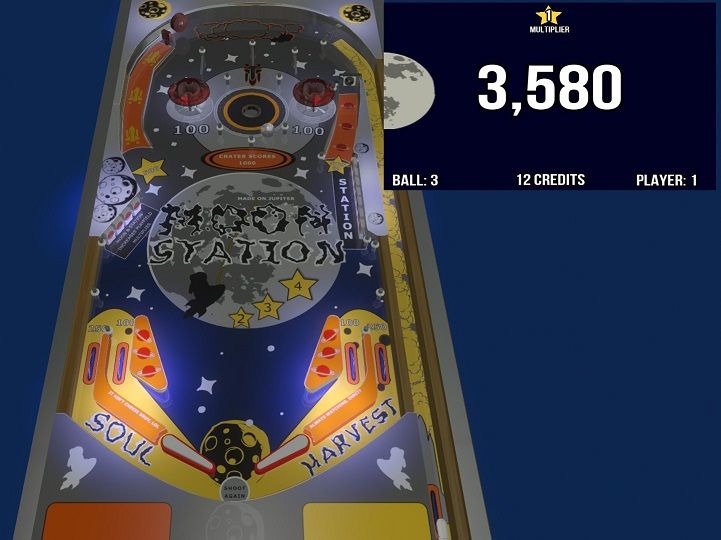

# PinGod - MoonStation
---

A basic example of creating a pinball with Visual Pinball and PinGod.



## Setup before running

In the PinGodot project directory add a symbolic link to where the addons directory is. *Full path is necessary*

```
mklink /D addons "C:\Users\funky\source\repos\PinGod\PinGod.VP.Examples\addons\addons"
```

You also could just make a copy of the addons and add it to the project.

# Logging.
---

Can view most of it from the debug console window but if you miss something they can be found at `C:\Users\YOURNAME\AppData\Roaming\Godot\app_userdata\MoonStation`.


# Moon Station - Visual Pinball
---

## Prequesites

- Visual Pinball 10.6
- PinGod.VP.Controller registered

## Setup

- Table script path to the `PinGodGame` should be edited.

## Extra Files

- MoonStation*.vbs

Just a file version of the table script to view outside of `Visual Pinball`. *Doesn't need to be used for the game to run.*

- `Playfield` drawings. Svg 

Used to export `Plastics` and `Playfield` artwork for the table with `Inkscape`.

## Rules

- Completing drop target banks increase table multiplier
